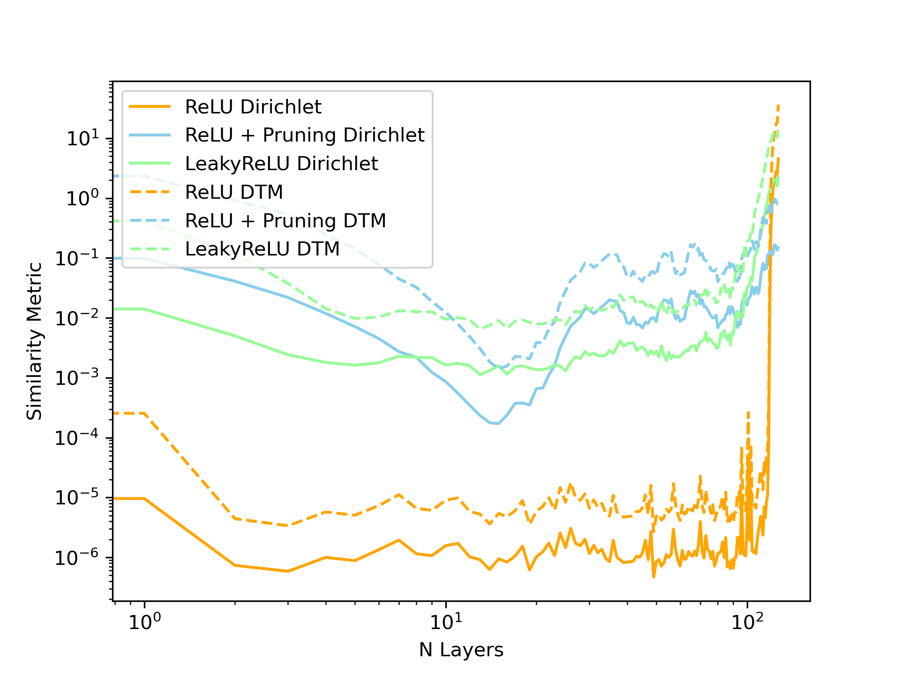

# You Only Live Twice - Investigating the Effects of Dying Neurons on Over-smoothing

Dying neurons are a well-known phenomenon that occurs when using ReLU activation functions. When a neuron is dead, it constantly outputs 0, is not trainable, and does not contribute
meaningfully to the final output. Despite this drawback, ReLU activation functions remain
a popular choice for many GNN architectures. We show that there is a direct link between
over-smoothing in ReLU-based GCNs and dying neurons. We demonstrate this by showing that
ReLU-based GCN models with fewer dying neurons suffer less from over-smoothing and generalize better. We prevent dying neurons in GCN layers by pruning the most negative weights
connected to the dead neurons. We demonstrate the effectiveness of this method on the CORA
dataset, achieving higher test accuracy for deep networks, fewer dead neurons, and reduced over-
smoothing based on similarity measures. Our findings not only highlight an effective method
to improve the performance of ReLU-based models but also show that avoiding dying neurons
can mitigate over-smoothing, indicating a direct connection between these two phenomena.



*Figure 1: Visualization of Dirichlet Energy and DTM Metric from Experiment 2.*

## Requirements

To install requirements:

```setup
pip install -r requirements_pip.txt
```

## Training

To test if the pipeline works you can train a simple model:

```test
python main.py
```

### Experiment 1

To replicate experiment 1, run:

```experiment1
python main.py --configs/experiment_1.yaml --experiment 1
```

### Experiment 2

To replicate experiment 2, run:

```experiment2
python main.py --configs/experiment_2.yaml --experiment 2
```

You can change the experiment and model parameters within the config. You can also change the experiment parameters if necessary.

## Results

You can find the results of the experiments in the results folder. Metrics are saved in JSON format. Checkpoints are saved as .pth files.

## Contributing

Contributions are welcome! Please feel free to submit a pull request.

## Acknowledgements

This project is part of the course "Graph Representation Learning" at the University of Oxford (MT24).

## Contact

If you have any questions, feel free to contact me at ...
